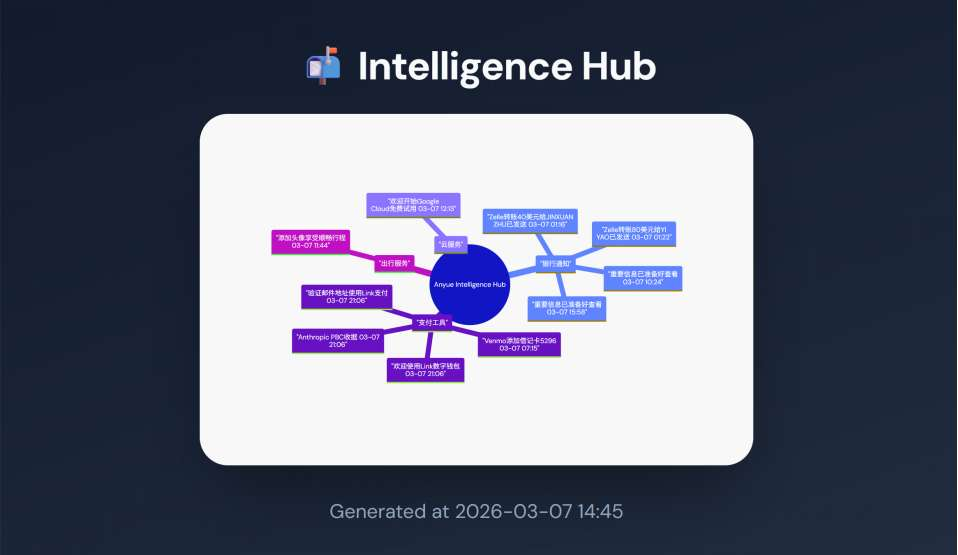

# 📬 Email Mindmap Agent

Analyze Gmail with Claude AI and generate mind map visualizations.

## Features

- Fetch the most recent N Gmail emails
- Use Claude Haiku to classify emails by topic
- Generate Mermaid mind maps with date/time
- Auto-open a styled HTML preview in the browser

## Example



## Requirements

- Python 3.8+
- [gws](https://github.com/googleworkspace/cli) (Google Workspace CLI for Gmail, requires OAuth)
- Anthropic API Key

## Installation

```bash
# Clone the repo
git clone https://github.com/caythelearner/email-mindmap-agent.git
cd email-mindmap-agent

# Install dependencies
pip install -r requirements.txt

# Configure
cp config.example.json config.json
# Edit config.json with your ANTHROPIC_API_KEY and MY_CONTEXT
```

## Configuration

| Field | Description |
|-------|-------------|
| ANTHROPIC_API_KEY | Get from [Anthropic Console](https://console.anthropic.com/) |
| GMAIL_USER_ID | Usually `me` |
| MAX_EMAILS | Number of emails to fetch, default 10 |
| MY_CONTEXT | Your background/context to help AI understand emails better |

## Usage

```bash
python main_agent.py
```

This generates `mindmap_preview.html` and opens it in your browser.

## Gmail Authorization

Install and configure gws first:

```bash
# Install gws (see https://github.com/googleworkspace/cli)
gws auth login
# Grant Gmail permissions when prompted
```

## License

MIT
